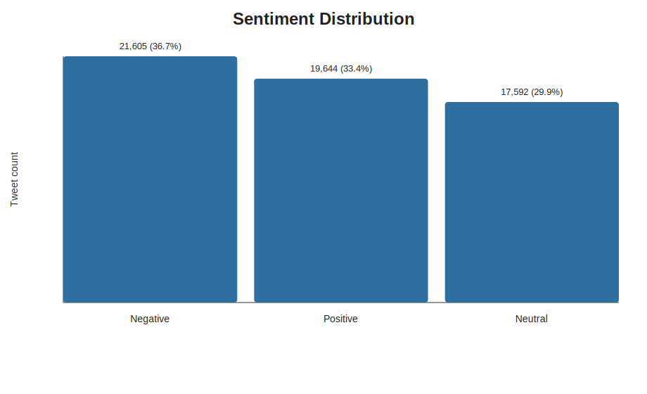
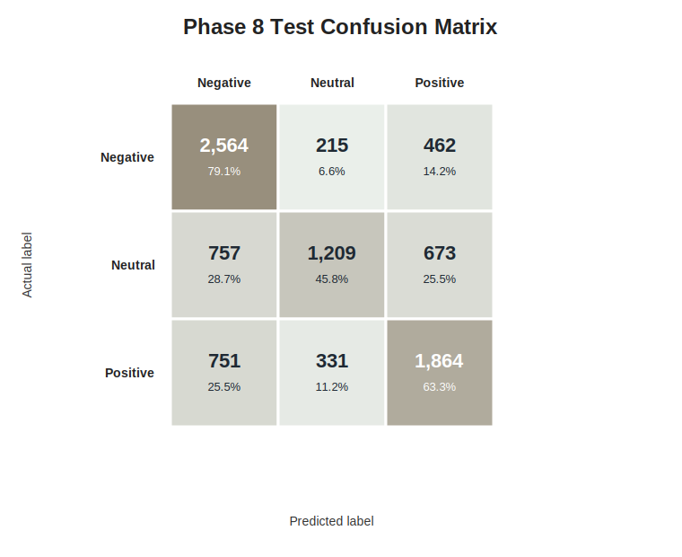
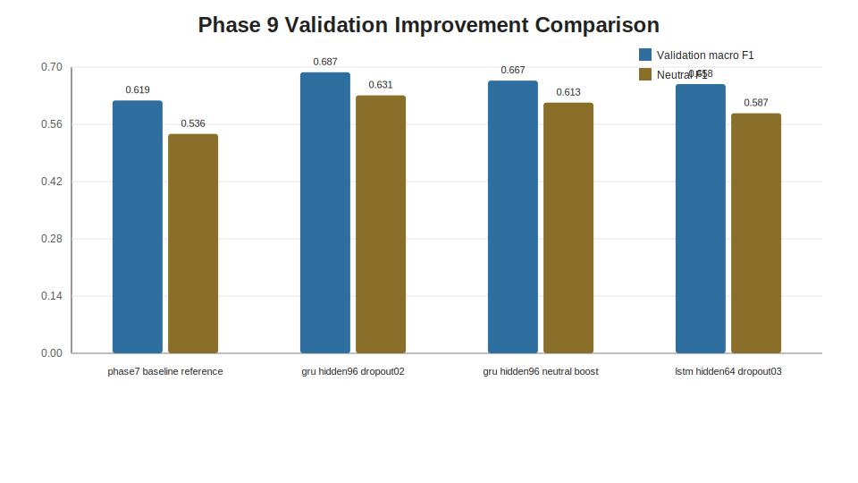

# RNN Twitter Sentiment Analysis

Professional end-to-end sentiment classification project for noisy Twitter text, built with a recurrent neural network pipeline and packaged for academic submission.

This repository contains a complete workflow for transforming raw tweet data into a validated three-class sentiment classifier. It covers data ingestion, cleaning, exploratory analysis, sequence feature engineering, GRU/LSTM modeling, held-out evaluation, validation-driven improvement, reporting, and final submission packaging.

## Problem Solved

Social media text is short, noisy, informal, and context dependent. A raw tweet may contain URLs, mentions, hashtags, repeated entities, profanity, missing values, duplicates, and ambiguous sentiment. This project solves the practical machine learning problem of converting that noisy text into a reliable sentiment signal across three classes:

- Negative
- Neutral
- Positive

The work is designed as an auditable machine learning pipeline, not just a one-off model. Each phase saves evidence in tables, figures, reports, checkpoints, and final submission artifacts so that the result can be reviewed, reproduced, and defended.

## Executive Results

| Area | Result |
|---|---:|
| Cleaned dataset size | 58,841 tweets |
| Classes modeled | Negative, Neutral, Positive |
| Train / validation / test split | 41,189 / 8,826 / 8,826 |
| Final vocabulary size | 17,924 tokens |
| Baseline model | Embedding + GRU |
| Held-out test accuracy | 0.6387 |
| Held-out test macro F1 | 0.6262 |
| Best validation candidate | GRU hidden size 96, dropout 0.20 |
| Best validation macro F1 | 0.6874 |
| Validation macro F1 lift vs baseline | +0.0689 |

Important evaluation note: the held-out test result belongs to the Phase 7/8 baseline checkpoint. Phase 9 selects an improved candidate using validation data only, preserving the test split for one final comparison if required.

## Tech Stack

| Layer | Tools |
|---|---|
| Language | Python |
| Data handling | pandas, NumPy |
| Text preprocessing | regex, NLTK, custom cleaning utilities |
| Feature engineering | token sequences, padding, vocabulary, TF-IDF metadata |
| Modeling | PyTorch, GRU, LSTM, embedding layers |
| Evaluation | scikit-learn metrics, confusion matrices, learning curves |
| Visualization | matplotlib, seaborn, wordcloud |
| Reporting | Markdown, ReportLab, Pillow, pypdf |
| Delivery | Jupyter Notebook, PowerPoint, PDF, ZIP package |
| Version control | Git, GitHub |

## Repository Structure

```text
.
|-- README.md
|-- PROJECT_CONTEXT.md
|-- requirements.txt
|-- twitter_training.csv
|-- notebooks/
|   `-- RNN_Sentiment_Analysis_Twitter.ipynb
|-- src/
|   |-- phase9_model_improvement.py
|   |-- phase10_final_deliverables.py
|   `-- create_final_submission_package.py
|-- outputs/
|   |-- data/
|   |-- figures/
|   |-- models/
|   |-- reports/
|   |-- submission/
|   `-- tables/
```

## Project Phases

| Phase | Purpose | Status |
|---:|---|---|
| 1 | Project setup and directory structure | Complete |
| 2 | Raw data loading and validation | Complete |
| 3 | Data cleaning and label alignment | Complete |
| 4 | Text preprocessing and token preparation | Complete |
| 5 | Exploratory data analysis and visualizations | Complete |
| 6 | Feature engineering and leakage-aware splitting | Complete |
| 7 | Baseline RNN modeling with GRU | Complete |
| 8 | Held-out test evaluation | Complete |
| 9 | Model improvement experiments | Complete |
| 10 | Final report, presentation, and submission packaging | Complete |

## Methodology

### 1. Data Understanding

The raw CSV contains tweet ID, entity/topic, sentiment, and tweet text. The original data includes four labels: Negative, Positive, Neutral, and Irrelevant. Because the assignment defines a three-class sentiment task, `Irrelevant` is documented and excluded from the main classifier instead of being merged into Neutral.

### 2. Cleaning And Preprocessing

The cleaning pipeline handles:

- Missing and blank tweet text
- Exact duplicate rows
- URLs, mentions, hashtags, special characters, and extra whitespace
- Lowercasing and tokenization
- Stop-word removal while preserving useful negation words
- Stemming with a deterministic fallback

Two text representations are maintained:

- `model_text` for sequence modeling
- `processed_text` / `analysis_text` for EDA, word frequency, and word clouds

### 3. Feature Engineering

The feature pipeline builds a training-derived vocabulary and converts tweets into padded integer sequences. It also stores TF-IDF vocabulary metadata as a secondary numerical representation and audit artifact.

Key controls:

- Vocabulary built from training rows only
- Dedicated `<PAD>` and `<OOV>` tokens
- Maximum sequence length of 60
- Group-aware train/validation/test split by cleaned `model_text`
- No duplicate cleaned text crossing split boundaries

### 4. Modeling

The baseline model is a compact sequence classifier:

```text
Embedding(vocab_size=17,924, embedding_dim=64)
GRU(hidden_dim=64)
Dropout(rate=0.30)
Linear classifier
```

Training uses class-weighted cross entropy and validation macro F1 for checkpoint selection.

### 5. Evaluation And Improvement

The baseline checkpoint is evaluated once on the held-out test split. Phase 9 then compares validation-only improvement candidates:

- Larger GRU with hidden size 96 and dropout 0.20
- Larger GRU with extra Neutral-class weighting
- LSTM alternative with hidden size 64

The best validation candidate improves macro F1 from 0.6185 to 0.6874.

## Visual Evidence

### Sentiment Distribution



### Held-Out Test Confusion Matrix



### Validation Improvement



## Key Artifacts

| Artifact | Description |
|---|---|
| [Notebook](notebooks/RNN_Sentiment_Analysis_Twitter.ipynb) | Full phase-by-phase implementation |
| [Final PDF report](outputs/submission/Module%2031%20-%20Graded%20Mini%20Project_Bhardwaj.pdf) | Primary submission document |
| [Submission ZIP](outputs/submission/Module_31_Graded_Mini_Project_Submission.zip) | Complete packaged submission bundle |
| [Executive presentation](outputs/reports/rnn_twitter_sentiment_final_presentation.pptx) | Premium presentation deck |
| [Final key metrics](outputs/tables/phase10_final_key_metrics.csv) | Concise metric summary |
| [Test metrics](outputs/tables/phase8_test_metrics.csv) | Held-out baseline evaluation |
| [Improvement experiments](outputs/tables/phase9_experiment_results.csv) | Validation experiment comparison |
| [Prediction samples](outputs/tables/phase8_test_prediction_samples.csv) | Sample tweet prediction demo |
| [Baseline checkpoint](outputs/models/phase7_baseline_gru_state.pt) | Saved Phase 7 GRU model |
| [Best validation checkpoint](outputs/models/phase9_best_validation_model_state.pt) | Saved Phase 9 selected model |

## How To Run

Create and activate a Python environment, then install dependencies:

```bash
pip install -r requirements.txt
```

Open the notebook and run it top to bottom:

```bash
jupyter notebook notebooks/RNN_Sentiment_Analysis_Twitter.ipynb
```

Optional: rerun the validation-only improvement experiments:

```bash
python src/phase9_model_improvement.py
```

Optional: regenerate the final PDF and ZIP submission package from existing artifacts:

```bash
python src/create_final_submission_package.py
```

## Submission Package

The final submission bundle is under `outputs/submission/`.

Primary file:

- `Module 31 - Graded Mini Project_Bhardwaj.pdf`

Supporting package:

- `Module_31_Graded_Mini_Project_Submission.zip`
- `README_SUBMISSION.md`
- `submission_manifest.csv`

The ZIP contains the notebook, raw dataset, source scripts, final report, deck, saved metrics, figures, model checkpoints, and prediction outputs.

## Evaluation Integrity

The project keeps a clear separation between validation and test evidence:

- Phase 7 trains the baseline using train and validation splits.
- Phase 8 evaluates the saved baseline exactly once on the held-out test split.
- Phase 9 uses only train and validation data for model improvement.
- Phase 10 reports Phase 8 test metrics and Phase 9 validation improvement separately.

This avoids overstating the final model by repeatedly tuning against the test set.

## Limitations

- Neutral sentiment remains the hardest class, especially for short or context-light tweets.
- The model uses corpus-trained embeddings rather than pretrained contextual embeddings.
- Sarcasm, entity-specific context, and world knowledge remain challenging for this RNN approach.
- The Phase 9 best model is validation-selected unless one final held-out test evaluation is explicitly required.

## Recommended Next Steps

- Run one final test evaluation for the selected GRU-96 candidate only if a final improved-model test comparison is required.
- Explore pretrained embeddings or transformer-based encoders for better contextual understanding.
- Review ambiguous Neutral examples to improve labeling consistency and class separability.
- Add calibrated confidence thresholds if the model is used in a decision-support workflow.

## License And Use

This repository was prepared for an academic graded mini project. The included dataset should be used according to the terms under which it was supplied for the course or assignment.
